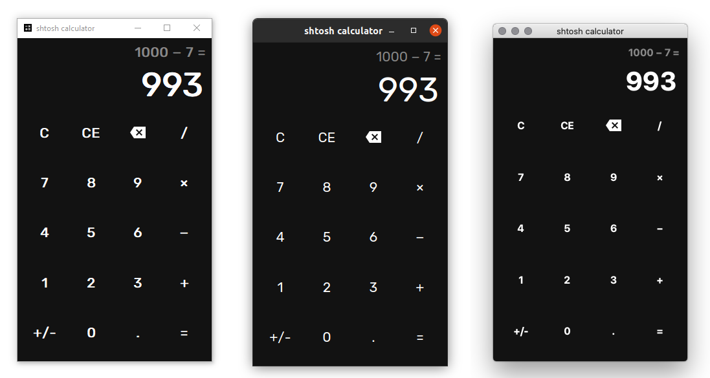

# Shtosh calculator

Simple cross-platform GUI calculator written in Python

## Requirements

Python 3.6+

`pip install -r requirements.txt`

## Tutorials

### YouTube

[Playlist](https://youtube.com/playlist?list=PLYnS0rRL606FQ3c4MURxJSNCIT0rrTUzB)

[First video](https://youtu.be/q3ma5waVGb0)

### Хабр

[Первая статья](https://habr.com/p/586730/)